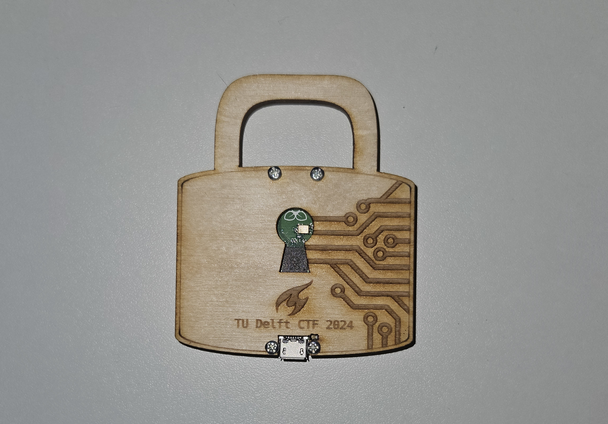

# Badge firmware 2024

## The badge



This repository contains files related to the TU Delft CTF 2024 hardware badge - a padlock-shaped laser-cut wooden badge with a [Raspberry Pi Pico](https://www.raspberrypi.com/products/raspberry-pi-pico/) inside.

## What's here?
This repository contains the following:
- the source code of the firmware & files necessary to build it (`src/`, `CMakeLists.txt`, `pico_sdk_import.cmake`)
- the SVG files with the design of the badge (`design/`)
- a prebuilt firmware image (`firmware.uf2`)
- a dirty shell script we used to flash 200 picos (`flasher.sh`)

## Building
To build the firmware, run the following commands or use the VS Code Raspberry Pi Pico extension:
```
$ mkdir -p build && cd build && cmake .. && make
```
Note that to build the firmware you'll need some dependencies - an instruction on how to install them is available [on the Raspberry Pi website](https://datasheets.raspberrypi.com/pico/getting-started-with-pico.pdf).

If you don't want to build the firmware yourself but still want to flash it on your Pico, you can use the provided [`firmware.uf2`](./firmware.uf2) file.

## Flashing
To flash the program to your Pico, either connect it to your computer while holding down the bootsel button and drag the `firmware.uf2` file to the mass storage media that will appear, or run the following command after connecting the Pico:
```
$ picotool load firmware.uf2 -f
```
This second option requires [picotool](https://github.com/raspberrypi/picotool) to be installed.

## The challenges
There are 4 challenges included in the firmware - `Hello Hardware`, `Black Box`, `Entropy Encrypter` and `Weary Watchdog`. You can find their descriptions in the [TU Delft CTF 2024 challenge repository](https://github.com/TU-Delft-CTF-Team/tudctf-2024-challenges/tree/main/hardware).

## How to start?
The main way of communicating with the badge is over the USB interface. After you connect the badge to your computer, it will show up as a serial device. The baudrate the badge is using is 115200. To interact with the badge, you might want to use [PuTTY](https://www.putty.org/) (if you're using Windows) or [Screen](https://www.gnu.org/software/screen/) or [Minicom](https://salsa.debian.org/minicom-team/minicom) (if you're using a UNIX-based system, such as Linux or macOS).
Note: if you want to interface with the badge as a non-root user on Linux, you have to add your user to the `dialout` group and restart your machine.